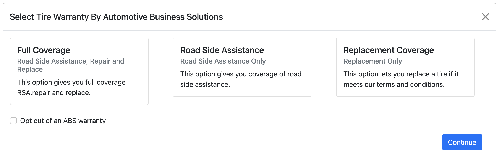

# Automotive Business Solutions Integration Challenge

## Setup

1. If you haven't already, sign up for GitHub and [install Git](https://git-scm.com/book/en/v2/Getting-Started-Installing-Git).
2. [Create a new repository](https://github.com/new) called `integration-challenge` and set it to Private.
3. Clone this repository. `git clone https://github.com/abs-warranty/integration-challange.git`
4. `cd` into the cloned integration-challenge repo and add your private repository as a remote, so you can push to it. `git remote add upstream git@github.com:YOUR_USERNAME/integration-challenge.git`
5. Create a new branch off of the `integration-challenge` repo where you will choose one of 2 integration challenges, and make your code changes. Open a PR to the `master` branch once you're done. `get checkout -b challenge-1 or challenge-2`
6. After you have finished coding one of the integration challenge options, and you're ready to push your code to your branch, make sure to do `git push upstream challenge-1 or challenge-2`.

Make sure you have Node.js and `yarn` installed globally, then start the repo:

```(terminal)
yarn install
yarn start
```

You should now have the app running on `http://localhost:8083`.

**Before submitting your code, please make sure to lint and format it.**

## Challenge

1. We'd like you to create your own modal component.

   - Treat it like a component that you'll be integrating in a variety of websites. Your code should be good quality, even if the client's website is not. Readable, maintainable code is good. Your modal should interfere as little as possible with the client’s website code, and it should be reusable in other websites. Remember, the client may modify their website's javascript code in the future, and ideally your integration should be separated enough from their code such that the modal can continue working.
   - Your modal's HTML, JavaScript, and CSS should be handwritten by you in vanilla JS. Please avoid the use of 3rd party libraries.
   - Your modal will ask the user to pick between 3 different warranty options, or opt out of selecting a warranty.
   - Here is a simple example modal where the three options could be selected when clicked.
     

2. Once you have your modal, the client has asked you to integrate it into their website (`client/tire-cart-1.html` or `client/tire-cart-2.html`)
   - Whenever a user clicks `Purchase`, your modal should appear.
   - When they submit the modal, their selection should be attached to the data that is posted.
   - Show the logged POST body before and after and with and without the warranty details.

## Tips

- Try not to remove or change the client's code where possible, but instead focus on adding to it.
- Adding classes or IDs to elements on the client's website is often ok if necessary to enable the javascript to access specific DOM elements.
- On some clients' websites, you may need to work around the way they coded their app.
